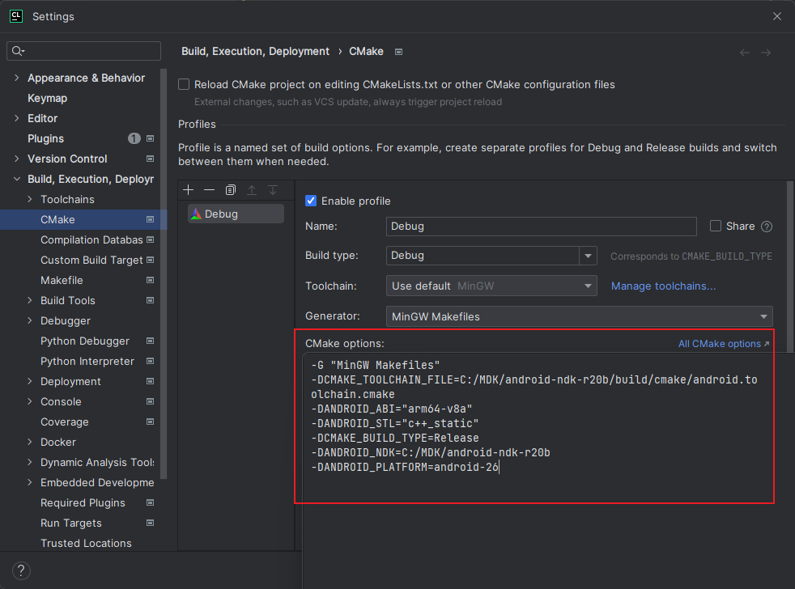

# ue4_cheat_engine

安卓UE4 FPS游戏测试读取数据/测试作弊
有自瞄以及数据读取测试

# 编译

- 直接编译
  1. 下载ndk20版本并在build/build.bat中设置ndk路径，执行build.bat进行编译
- Clion工具编译
  1. 需要将一下参数复制到cmake optinos中

  ```

  cmake -G "MinGW Makefiles"
  -DCMAKE_TOOLCHAIN_FILE=C:/MDK/android-ndk-r20b/build/cmake/android.toolchain.cmake
  -DANDROID_ABI="arm64-v8a"
  -DANDROID_STL="c++_static"
  -DCMAKE_BUILD_TYPE=Release
  -DANDROID_NDK=C:/MDK/android-ndk-r20b
  -DANDROID_PLATFORM=android-26

  ```

  

# 提示

此项目用于学习、测试UE4 FPS游戏安全性，禁止用于非法用途
